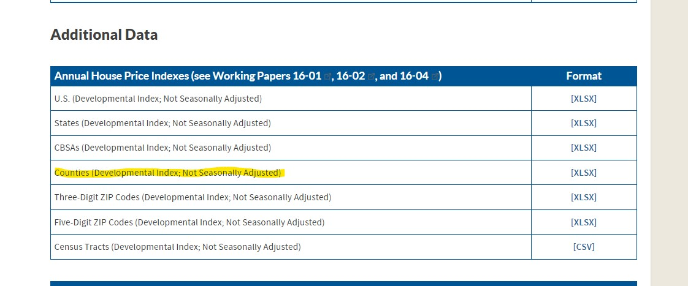
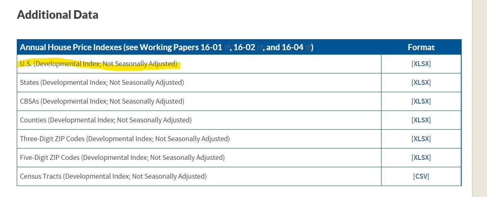

# README - HPI, Federal Housing Finance Agency

## I. Pipeline

* **Input**: [House Price Index Datasets | FEDERAL HOUSING FINANCE AGENCY (fhfa.gov)](https://www.fhfa.gov/data/hpi/datasets?tab=additional-data)
    * `HPI_AT_BDL_county.xlsx`
    * `HPI_AT_BDL_national.xlsx`
* **Processing files**:
    * `make.do`
* **Output**: 
    * `hpi.dta`: county-level HPI
    * `hpi_national.dta`: national aggregate HPI
* **Variables**
    * `hpi.dta`
        * `fips`: County 5-digit FIPS code
        * `fips_state`
        * `fips_county`
        * `year`
        * `hpi`: County Dev HPI
    * `hpi_national.dta`
        * `year`
        * `hpi_national`

## II. Data download






## III. Data processing tricks

For random missing points, we linearly interpolate/extrapolate on the _county_'s own time series.

## IV. Directory tree

Here is a snapshot of my directory tree:

```cmd
D:.
│   hpi.dta
│   hpi_national.dta
│   make.do
│   README.md
│
└───original
        HPI_AT_BDL_county.xlsx
        HPI_AT_BDL_national.xlsx
        HPI_AT_BDL_ZIP5.xlsx
```
*Working paper*.