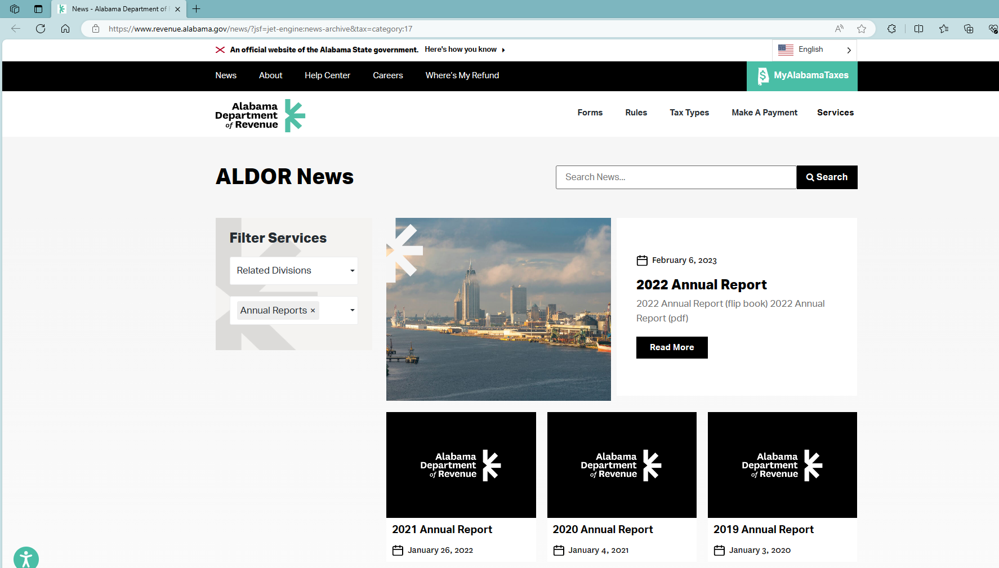
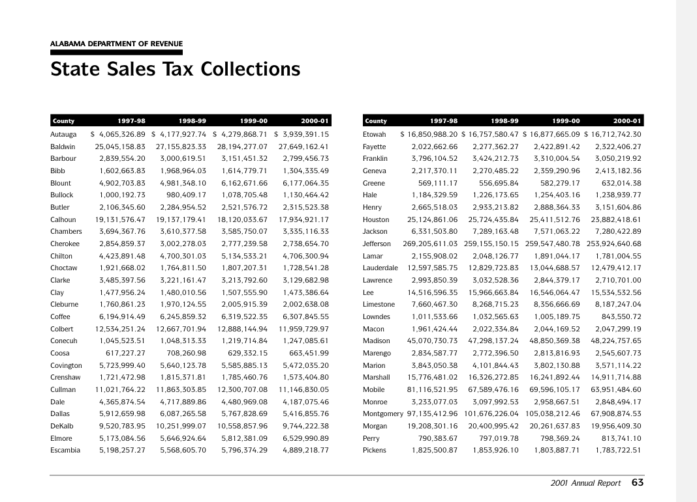
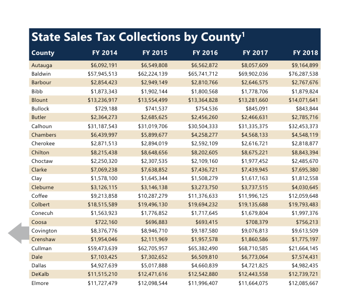

# README

* Data source: [News - Alabama Department of Revenue](https://www.revenue.alabama.gov/news/?jsf=jet-engine:news-archive&tax=category:17)
    * Record date: 3/30/2023
    * There is a new look of Alabama Department of Revenue’s website
    * If the website continues updating, please find new addresses by checking “News” --> “Annual Reports”
    * By the date of record, annual reports in PDF formats are available from 2001 to 2022
* For 2019 *calendar year*, annual report PDF is named as `2020_01_2019-Annual-Report.pdf`. The first year (in this example, 2020) is the year of revision/publication.
* Collected data in unit of dollar \$
* The data of **State** Sales Tax Collection across counties are discontinued since fiscal year 2019. We scale 2018 data to 2019 by keeping the distribution across counties but using the total amount of 2019.

