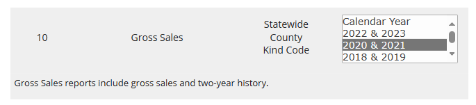

# README

1. Data source: [Florida Dept. of Revenue - taxresearch (floridarevenue.com)](https://floridarevenue.com/DataPortal/Pages/TaxResearch.aspx)
    1. Calendar year
    2. Under “General Tax Collections” section, we use “gross sales”
2. The summation formula for Okaloosa county in 2016-2017 file is missing. Needs to be added manually

