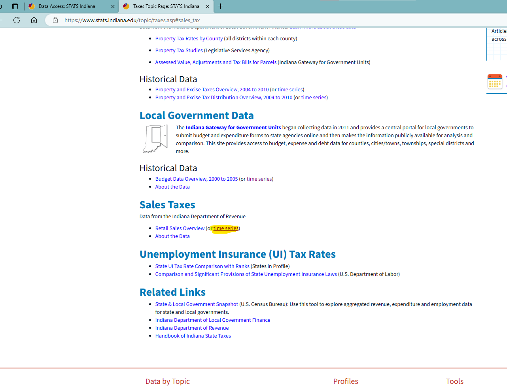
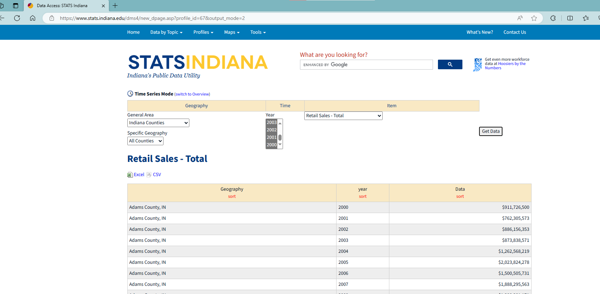

# README

1. Data source: [Data Access: STATS Indiana](https://www.stats.indiana.edu/dms4/new_dpage.asp?profile_id=378&output_mode=2)
    1. [Taxes Topic Page: STATS Indiana](https://www.stats.indiana.edu/topic/taxes.asp#sales_tax)
    2. Indiana DoR does not provide data in their annual report but use a platform called STATSINDIANA at "https://www.stats.indiana.edu/topic/taxes.asp#sales_tax". Under "Sales Taxes" click "Retail Sales Overview (or time series)".
    3. In the search page, choose time series mode, set "General Area" as "Indiana Counties", set "Specific Geography" as "All Counties", set "Item" as "Retail Sales - Total". Set one year and click "Get Data" to get a cross-sectional dataset
    4. Since Indiana directly reports tax base, then no need to adjust by county-wise sales tax rate. Just use the downloaded data

