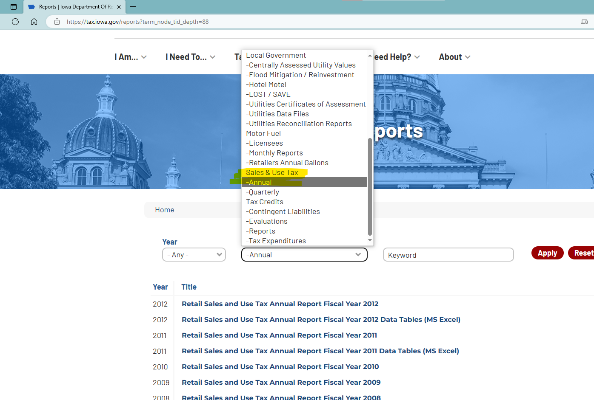
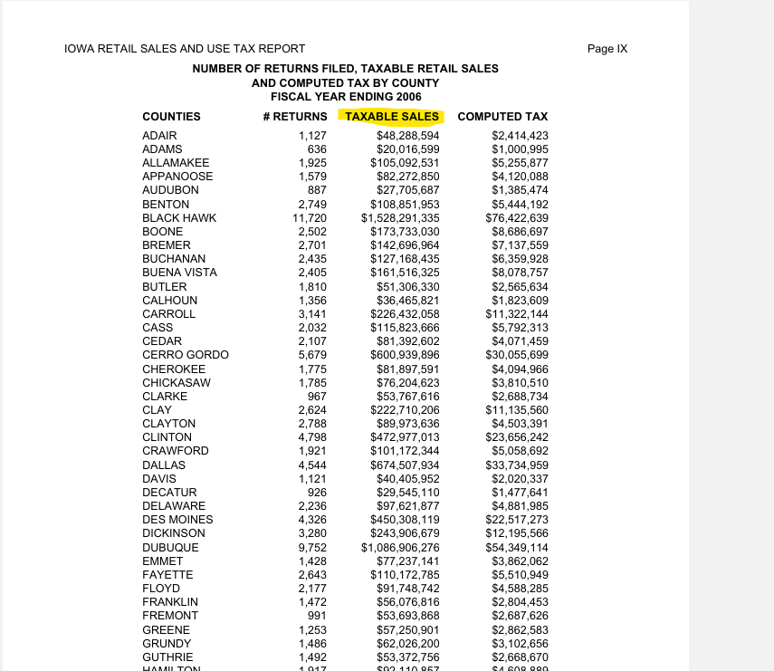

# README

1. Data source: [Reports | Iowa Department Of Revenue](https://tax.iowa.gov/reports?term_node_tid_depth=88)

2. Iowa DoR reports sales and use tax data in excel since 2011. Before that, these data are available in pdf

3. Iowa DoR reports “taxable sales”, so we use this. No need to adjust by sales tax rate. In excel files, the worksheet we use is "Retail Sales by County"

