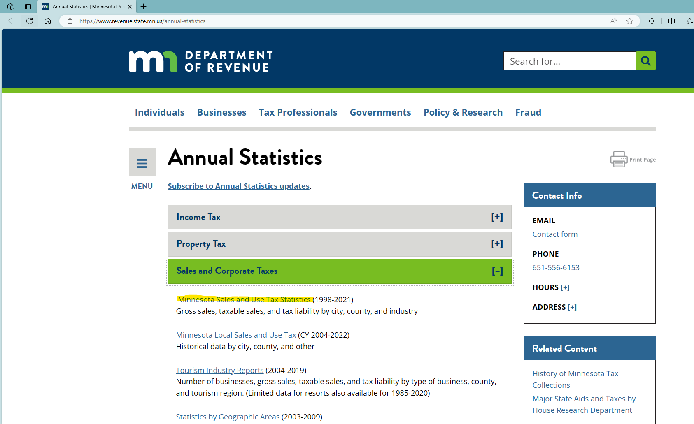
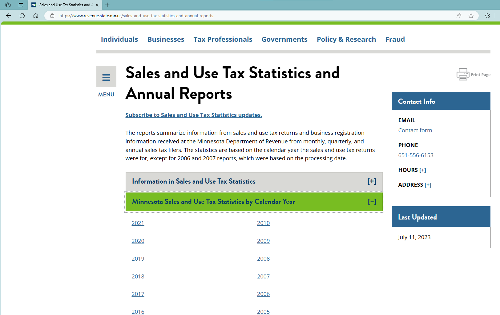
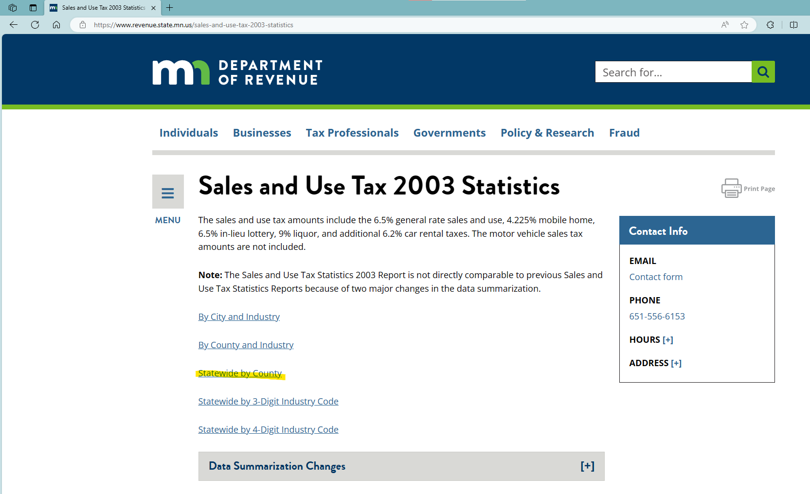
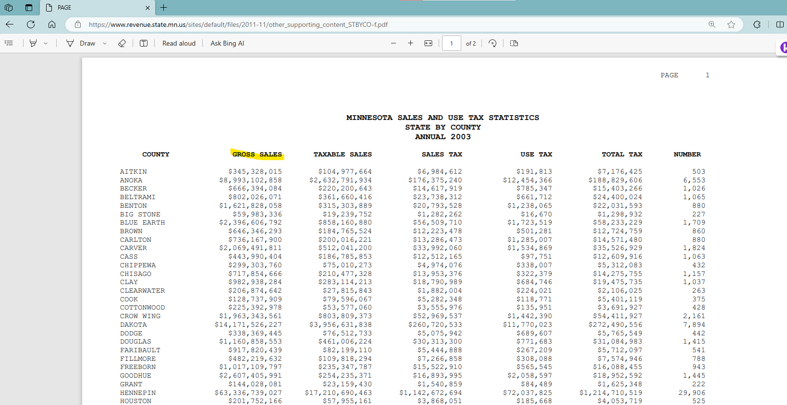

# README

1. Data source: [Sales and Use Tax Statistics and Annual Reports | Minnesota Department of Revenue (state.mn.us)](https://www.revenue.state.mn.us/sales-and-use-tax-statistics-and-annual-reports)
2. Minnesota DoR reports "Minnesota Sales and Use Tax Statistics by Calendar Year" rather than fiscal year. Specifically, under this section, we use number from "Statewide by county" or "State Totals by County".
3. We use "gross sales".
4. We linearly interpolate year 2001 and 2002 using 2000 & 2003 data

