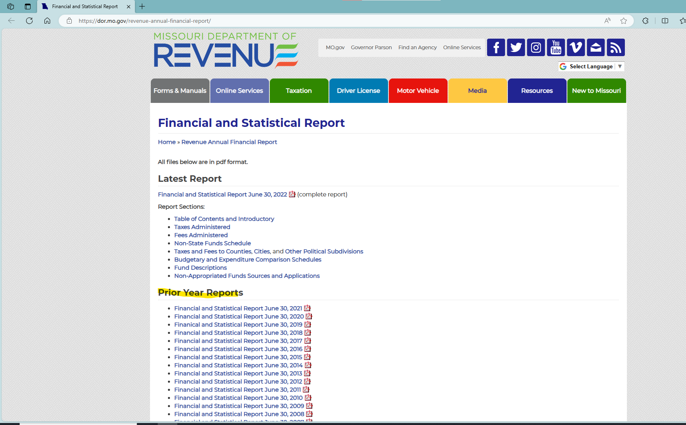
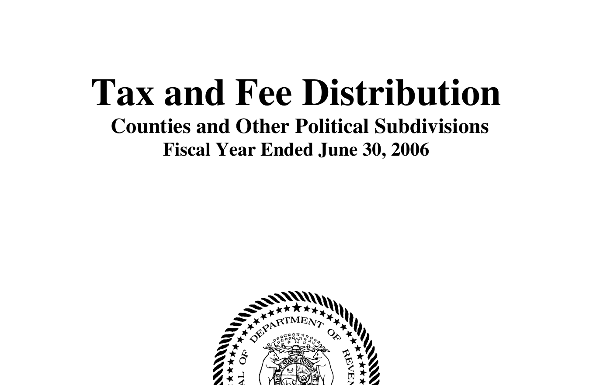
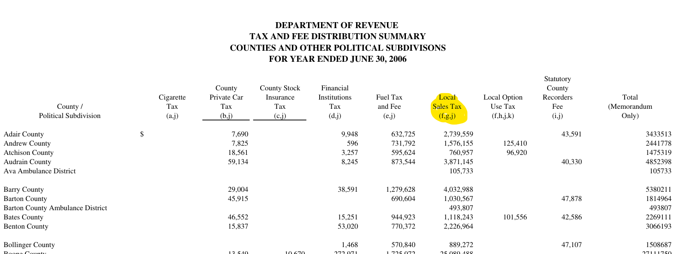
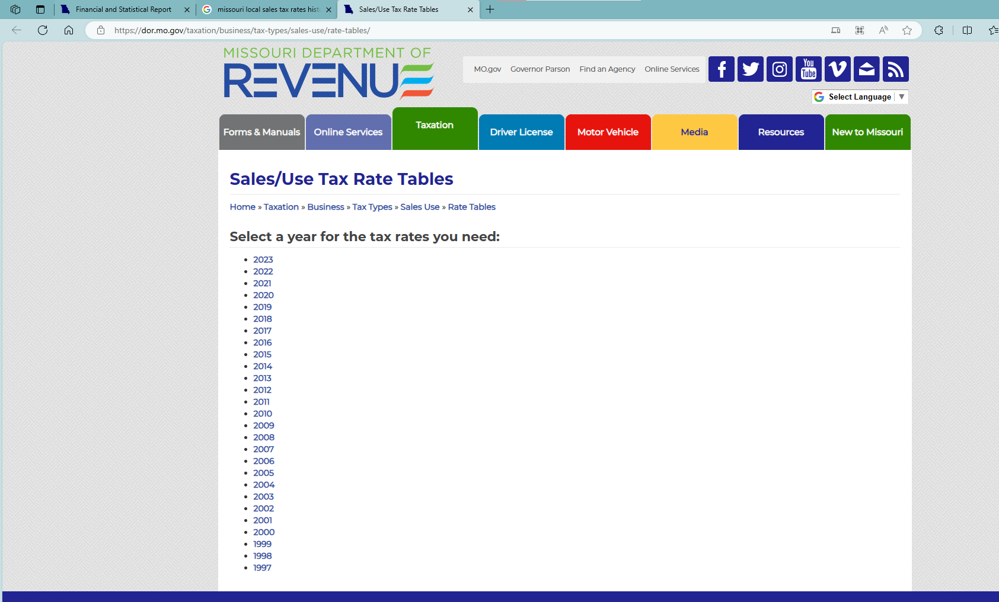
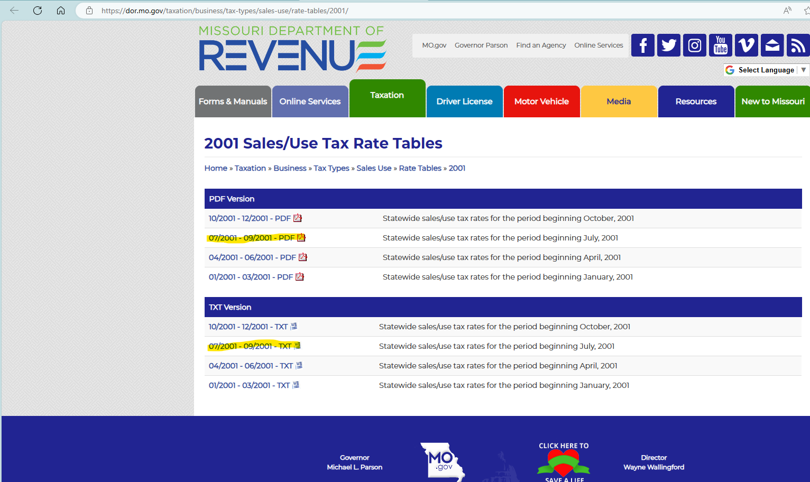
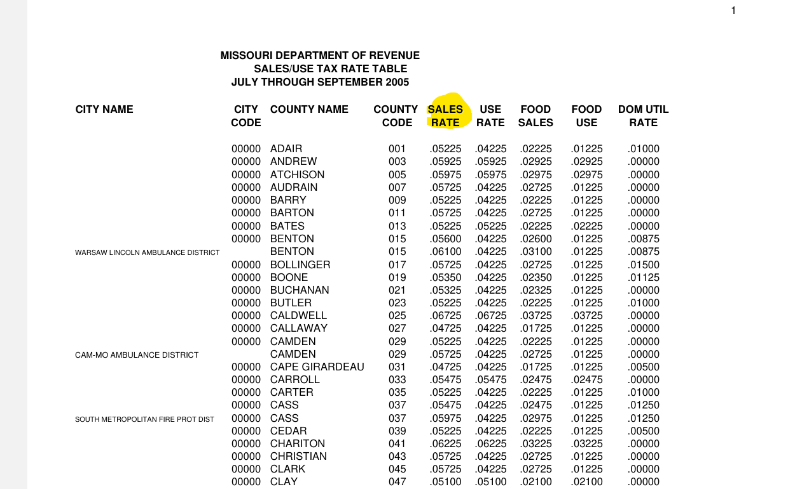

# README

1. Data source: [Financial and Statistical Report (mo.gov)](https://dor.mo.gov/revenue-annual-financial-report/)
    1. Missouri DOR reports collections.
    2. We use “Tax and Fee Distribution Counties and Other Political Subdivisions” --> “Local Sales Tax (f,g,j)” because there is no state sales tax collection by county. Thus, ==the number must be adjusted by local sales tax rate==. The rates can be found at: [Sales/Use Tax Rate Tables (mo.gov)](https://dor.mo.gov/taxation/business/tax-types/sales-use/rate-tables/)
    3. For the tax rates:
        1. We use "Statewide sales/use tax rates for the period beginning JULY, xxxx" to represent the whole fiscal year e.g. ".... JULY, 2010" for FY 2011.
        2. We use "SALES RATE"
        3. We ignore special areas in a county e.g., “WARSAW LINCOLN AMBULANCE DISTRICT”
        4. The first dozens of rows without a city name but with city code being 00000 are designed for counties
        5. Technically, we first convert the pdf rates files to xlsx by Acrobat, then do the left operations in Excel

