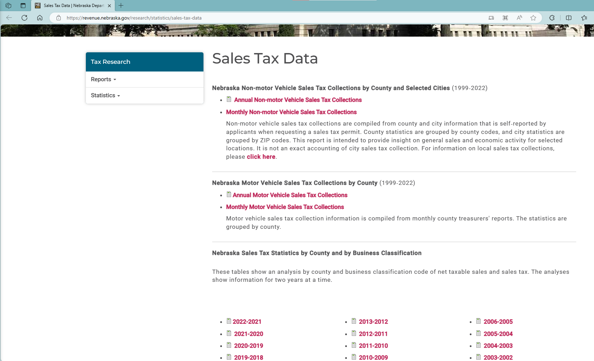

# README

1. Data source: [Sales Tax Data | Nebraska Department of Revenue](https://revenue.nebraska.gov/research/statistics/sales-tax-data)
    1. Nebraska reports "Nebraska Sales Tax Statistics by County and by Business Classification" as excel files. We use the “Total” of "Net Taxable Sales", so no need to adjust by tax rates.

