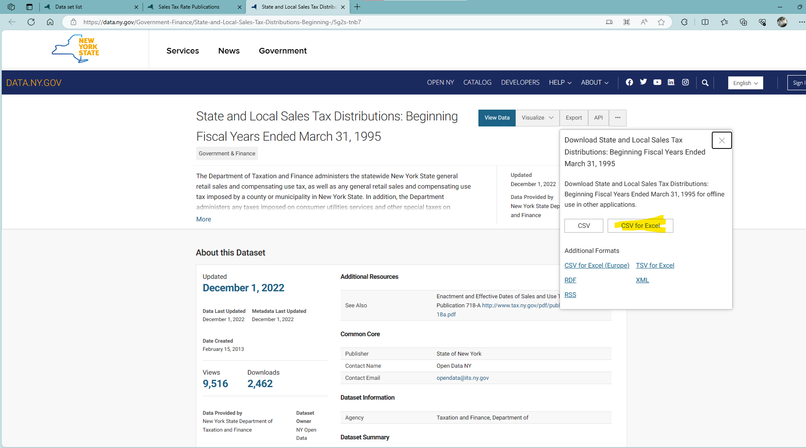
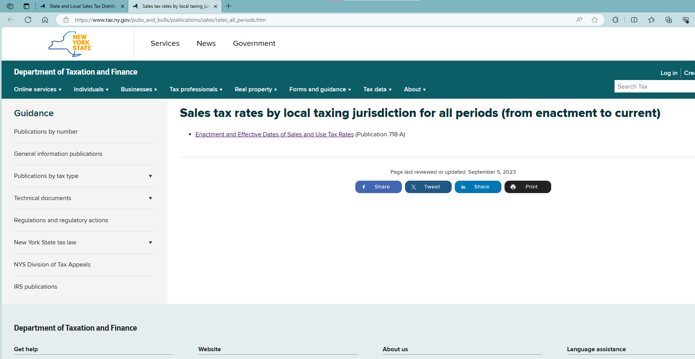
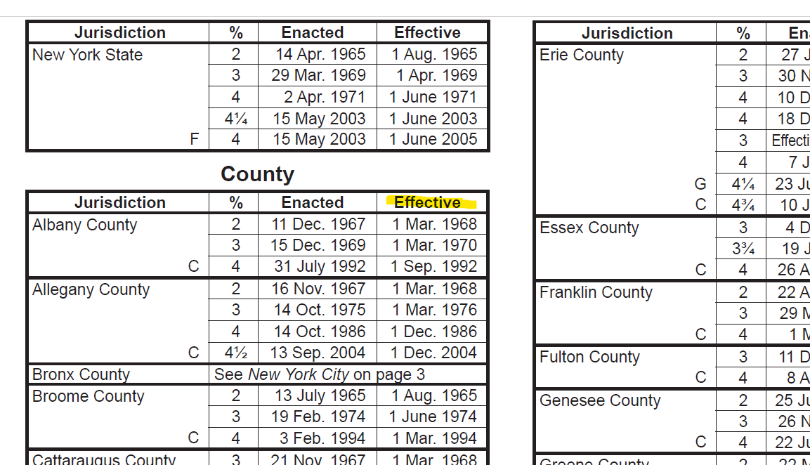
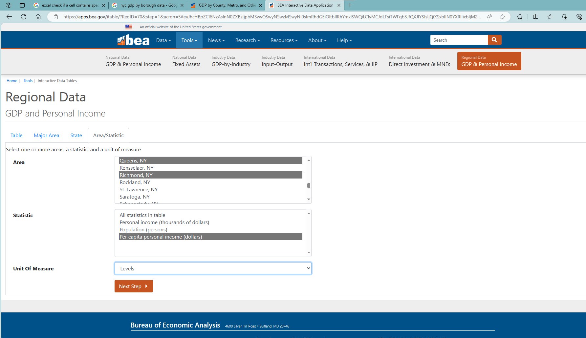
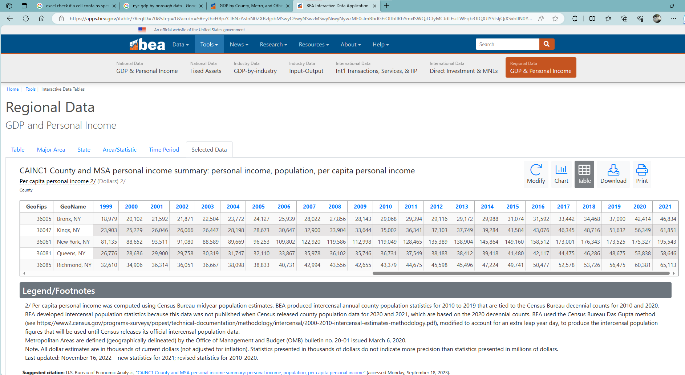

# README

1. Data source: [State and Local Sales Tax Distributions: Beginning Fiscal Years Ended March 31, 1995 | State of New York (ny.gov)](https://data.ny.gov/Government-Finance/State-and-Local-Sales-Tax-Distributions-Beginning-/5g2s-tnb7)
    1. Data source of tax rates: [Sales tax rates by local taxing jurisdiction for all periods (from enactment to current) (ny.gov)](https://www.tax.ny.gov/pubs_and_bulls/publications/sales/rates_all_periods.htm)
    2. New York state has another dataset since 2013 for taxable sales by county and industry. We (for now) do not use that to be consistent across years
2. The tax collection of the counties in NYC is reported as a whole. We need to split it into the five counties of NYC. To determine the distribution, we use the shares of personal income per capita by borough/county from BEA in NYC

