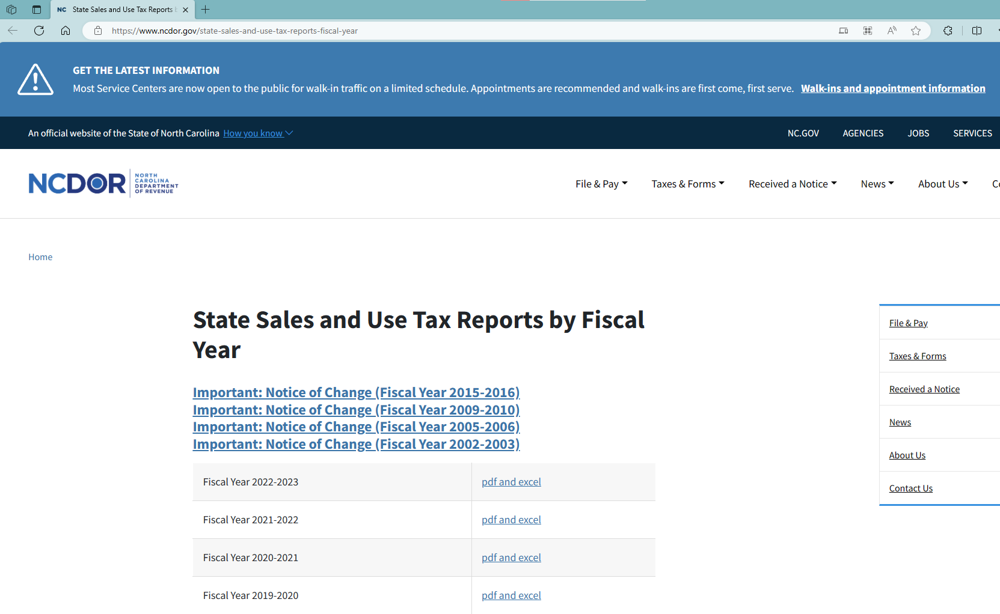

# README

1. Data source: [State Sales and Use Tax Reports by Fiscal Year | NCDOR](https://www.ncdor.gov/state-sales-and-use-tax-reports-fiscal-year)
    1. Excel files available since FY 2000-2001
    2. We use “Gross Retail Sales” in sheet “County Summary” of excel files

