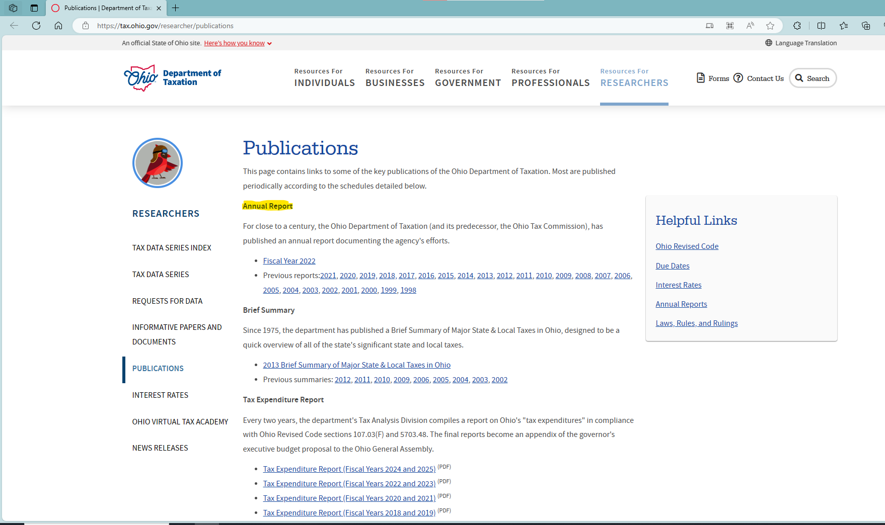
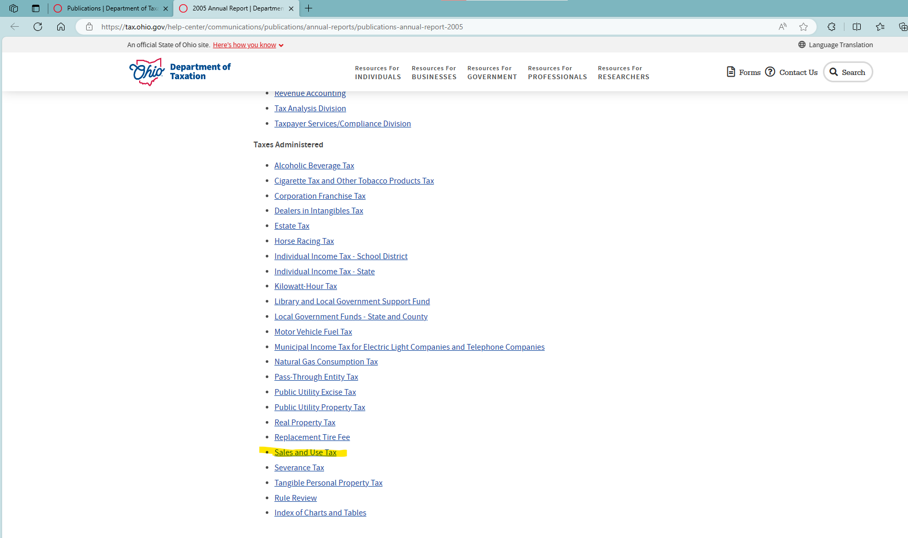
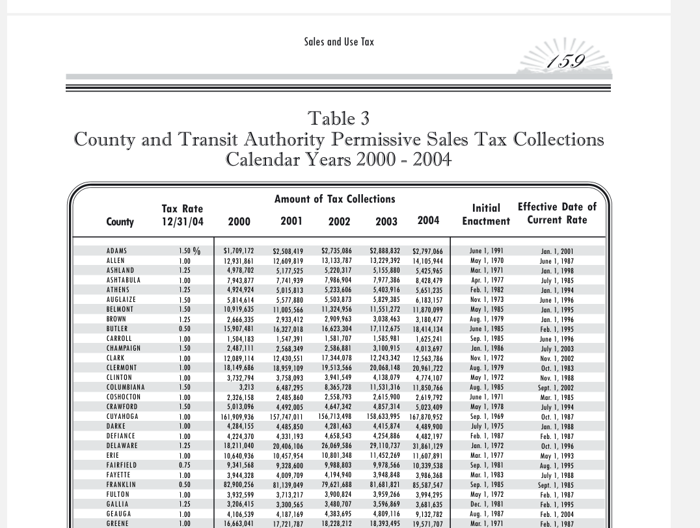

# README

1. Data source: [Publications | Department of Taxation (ohio.gov)](https://tax.ohio.gov/researcher/publications)
    1. We use the “Sales and Use Tax” section in annual reports. These reports are provided in pdf files by each section
    2. Ohio reports calendar year tax revenue. Needs to be adjusted by tax rate to recover taxable sales

