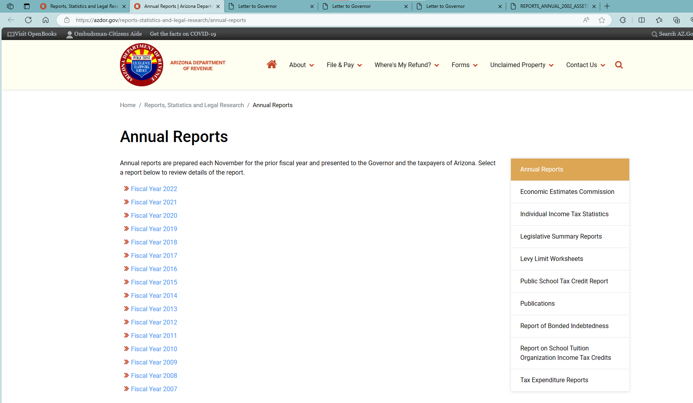
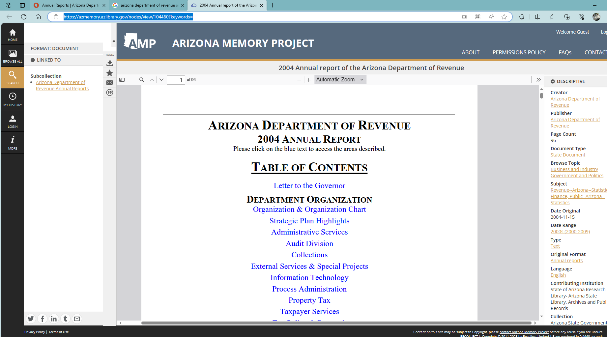
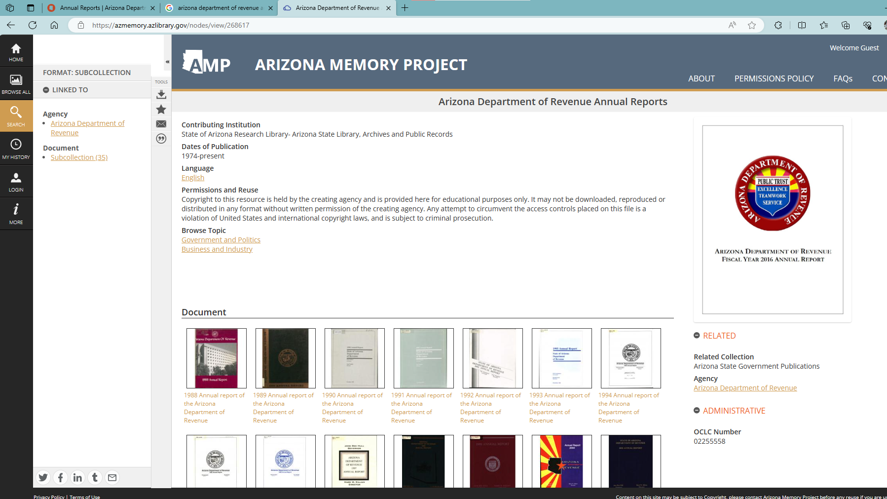
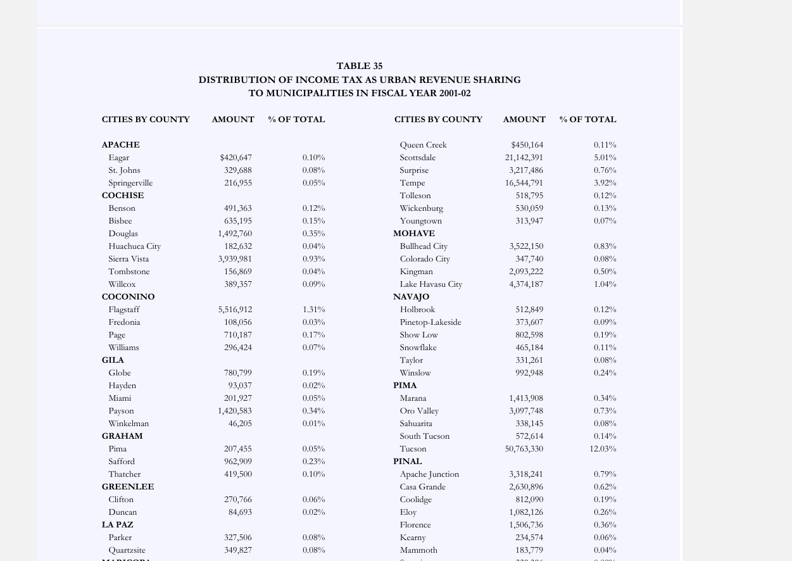

# README

1. Data source: [Annual Reports | Arizona Department of Revenue (azdor.gov)](https://azdor.gov/reports-statistics-and-legal-research/annual-reports)
    1. Annual reports before 2007 are not listed on websites but can be accessed by link directly, including:
        1. [Annual Report FY 06 (azdor.gov)](https://azdor.gov/sites/default/files/2023-03/REPORTS_ANNUAL_2006_ASSETS_fy06_annual_report.pdf)
        2. [Annual Report FY 05 (azdor.gov)](https://azdor.gov/sites/default/files/2023-03/REPORTS_ANNUAL_2005_ASSETS_fy05_annual_report.pdf)
        3. [Annual Report FY 02 (azdor.gov)](https://azdor.gov/sites/default/files/2023-03/REPORTS_ANNUAL_2002_ASSETS_fy02_annual_report.pdf)
    2. Other years can be accessed from Arizona’s digital collections, e.g.,
        1. 2004: [2004 Annual report of the Arizona Department of Revenue | Arizona Memory Project (azlibrary.gov)](https://azmemory.azlibrary.gov/nodes/view/104460?keywords=)
2. Arizona collects “income tax” from corporates and individuals. The former is in-fact sales tax (can be seen from the taxed items in the reports). We use distribution to city/town data and aggregate them to county level. (TABLE 35 for year before 2018, and TABLE 36 for year since 2018).
3. The reported data mixed corporates and individual income tax revenues. There is no way to distinguish. May need further corrections in the future.
4. No local tax rates available, so impossible to do adjustment

