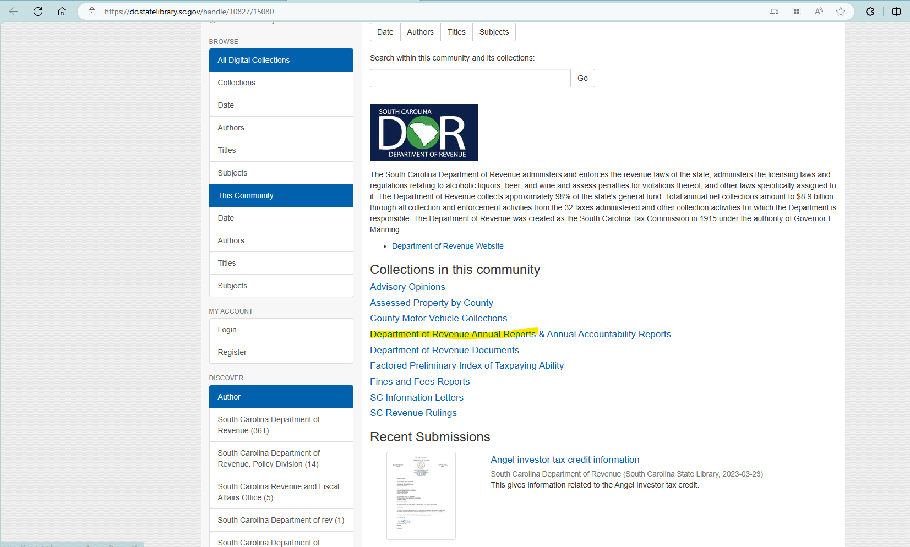

# README

1. Data source: 
    1. since 2010: [Publications- Reports (sc.gov)](https://dor.sc.gov/communications/reports)
    2. before 2010: [Department of Revenue (sc.gov)](https://dc.statelibrary.sc.gov/handle/10827/15080)
1. South Carolina began to publish annual reports with "Gross Sales" and "Total Net Taxable Sales" by county since FY 2011 on DoR website. For data before 2011, South Carolina archived their annual reports in online state library at "https://dc.statelibrary.sc.gov/handle/10827/15080". FY 2006-2010 annual reports with gross sales and total net taxable sales are available their as pdf. 2006-2010 pdf are consistent with 2011-2019 pdf about gross sales and total net taxable sales statistics.
    1. Using FY 2005-2006 as an example, because more months are covered in year 2006 (Jan 06 - Sep 06), we identify the sales happening in FY 2005-2006 as the sales in year 2006

1. To better approximate general consumption stuff, we use "Gross Sales". No need to adjust by tax rate.
1. Horry county in FY 2013 item is exactly the same as Hampton county in FY 2013 in annual report, this might be typo cuz the two counties are not at the same sacle, so we linearly interpolate gross sales for Horry county in FY 2013.
1. In addition to the state library, vehicle sales & tax collection data can also be found at: [Tax Collections by County (sc.gov)](https://dor.sc.gov/lgs/reports-tax-collections-by-county) which might be potentially useful in the future
1. Some year’s annual reports are missing from DOR website nor the state library. We found them by finding the naming rule of URLs. You may access these files directly via:
    1. FY 2004-2005: `[annual report 04-05 cover.pub (sc.gov)](https://dor.sc.gov/resources-site/publications/Publications/2004-2005 Annual Report.pdf)`
    1. FY 2001-2002: [table of contents.xls (sc.gov)](https://dor.sc.gov/resources-site/publications/Publications/2001-2002 Annual Report.pdf)
1. FY 2000-2001 is missing. We linearly interpolate it using FY 1999-2000 and FY 2001-2002.

