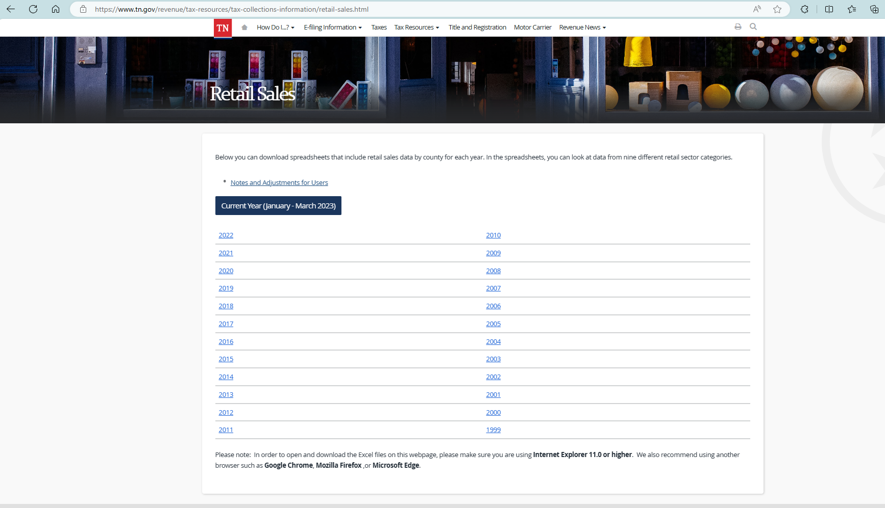

# README

1. Data source: [Retail Sales (tn.gov)](https://www.tn.gov/revenue/tax-resources/tax-collections-information/retail-sales.html)
    1. “Tax Resources” --> “Tax Collections & Reporting” --> “Retail Sales”
    2. Data are provided in excel files

1. No need to adjust by tax rates.