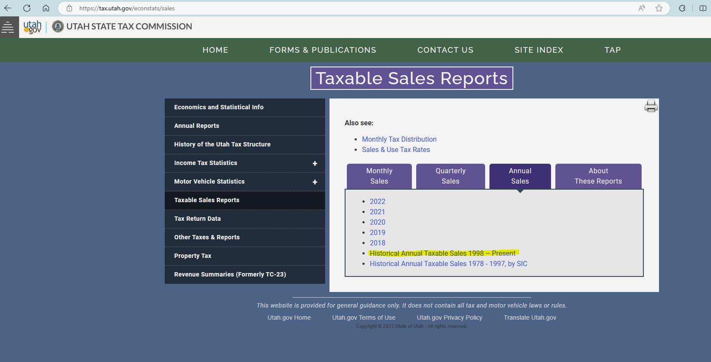
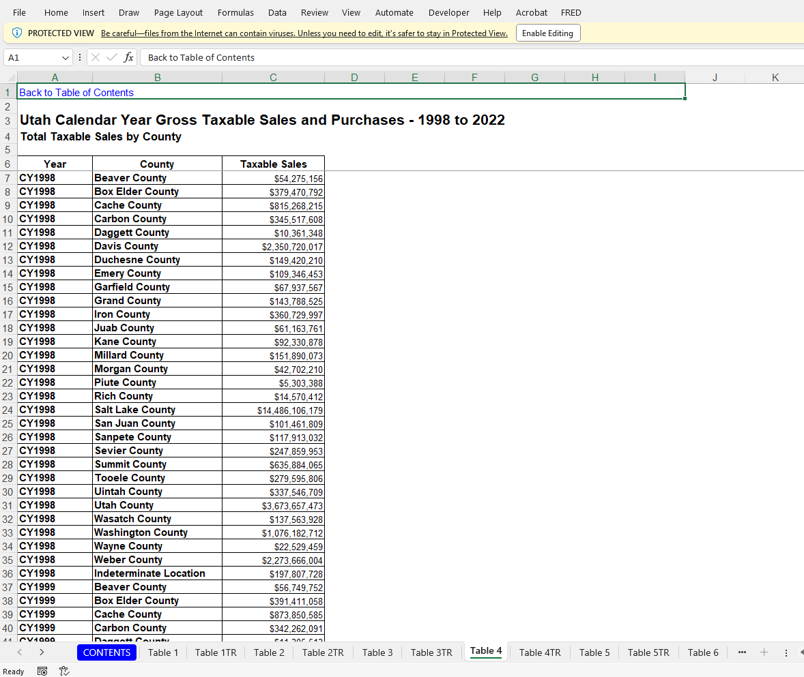

# README

1. Data source: [Taxable Sales Reports (utah.gov)](https://tax.utah.gov/econstats/sales)

    1. “Taxable Sales Reports” --> “Annual Sales” --> “Historical Annual Taxable Sales 1998-Present” as an excel file
    2. Table 4 “Total Taxable Sales by County”

    

