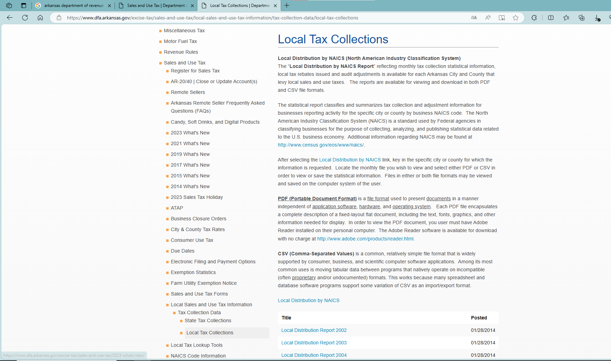
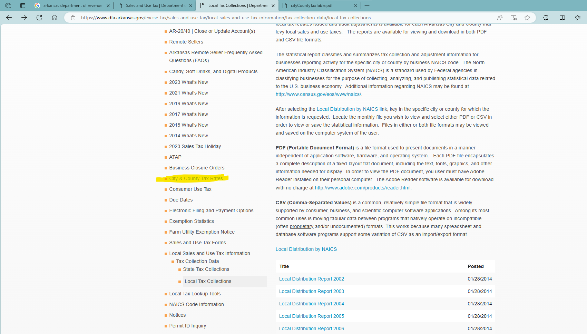

# README

1. Data source: [Local Tax Collections | Department of Finance and Administration (arkansas.gov)](https://www.dfa.arkansas.gov/excise-tax/sales-and-use-tax/local-sales-and-use-tax-information/tax-collection-data/local-tax-collections)
    1. We use local distribution reports.
    2. We use the current tax rates for all years since no history rates found
2. In the local distribution reports, county-level data locate in the ending of the report in early years, but mixed with cities/towns recently (since 2009)
3. We dropped the following counties:
    1. Monroe: zero county rates in most years
    2. Pulaski County River project: too severe tax reforms, and not a county
    3. Saline: too severe tax reforms
    4. Yell: missing data before 2005

