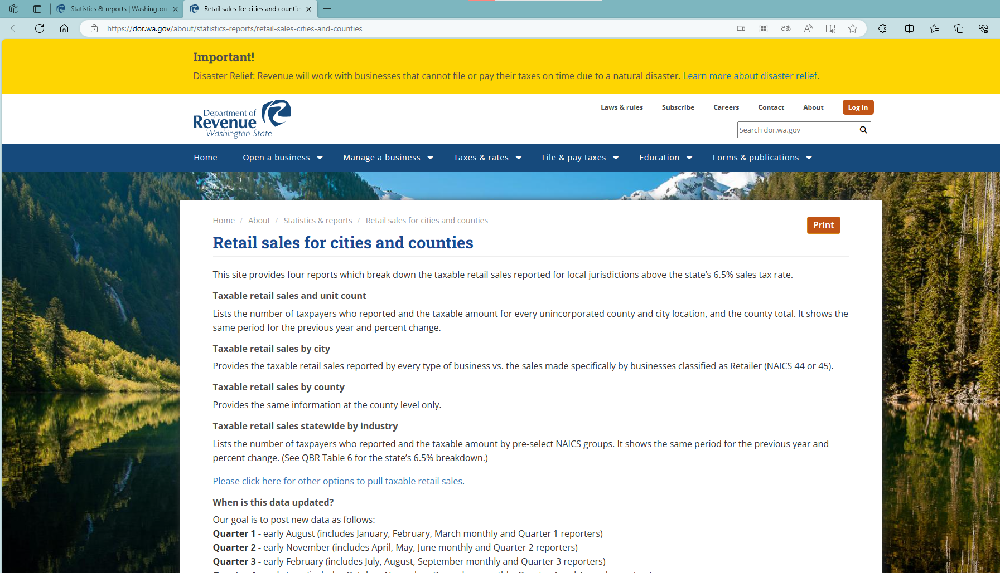
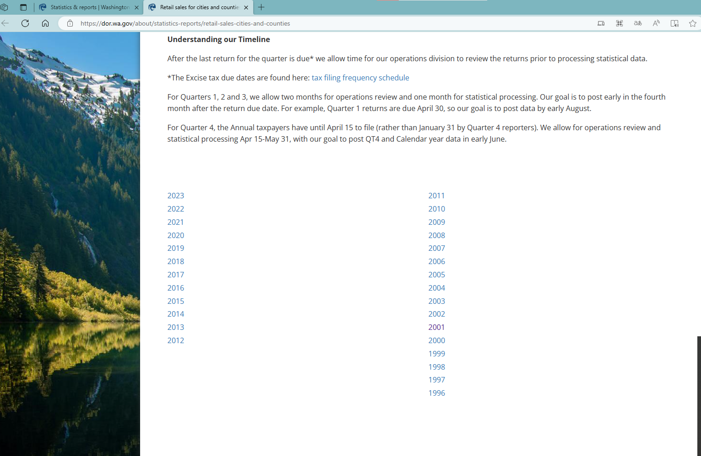
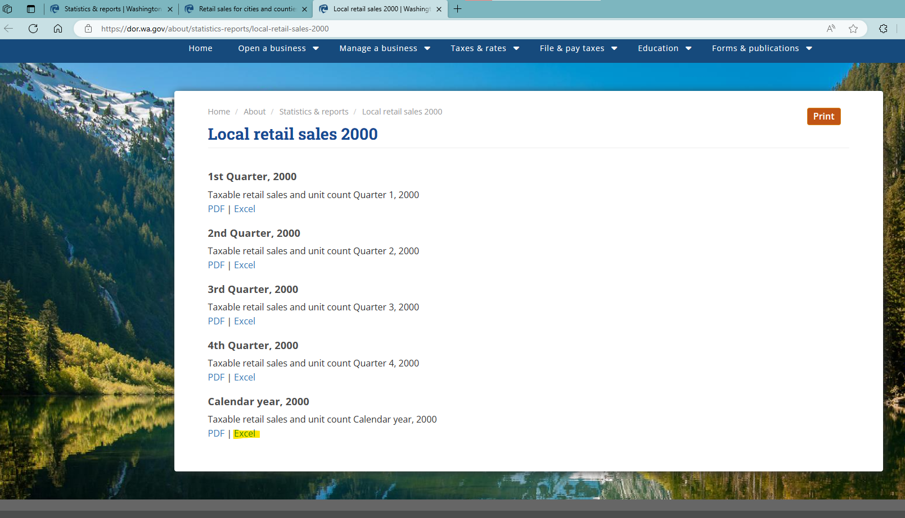
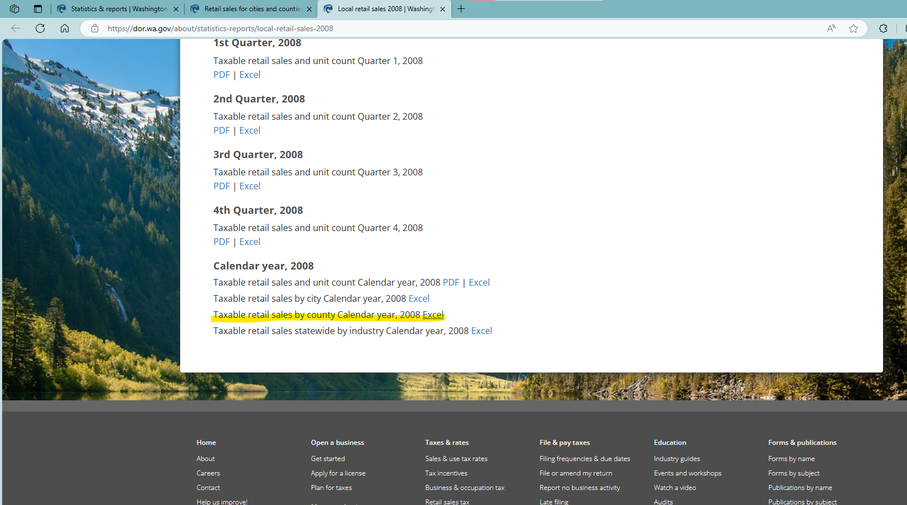
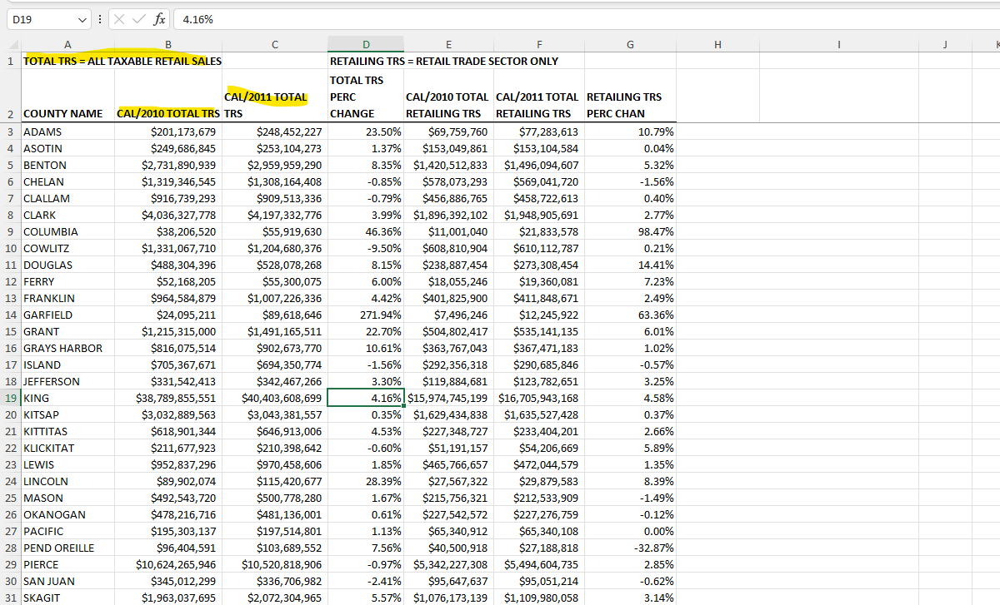
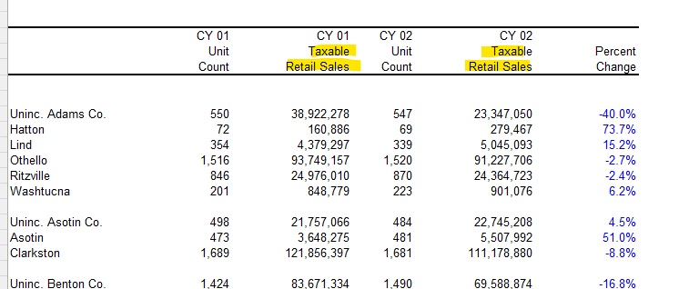

# README

1. Data source: [Retail sales for cities and counties | Washington Department of Revenue](https://dor.wa.gov/about/statistics-reports/retail-sales-cities-and-counties)
    1. We use “Taxable Retail Sales” of calendar years
    2. The reported item changed since 2008
        1. before 2008: taxable retail sales
        2. since 2008: total taxable retailing sales
    3. We ignore the inconsistence due to non-taxable retail sales

