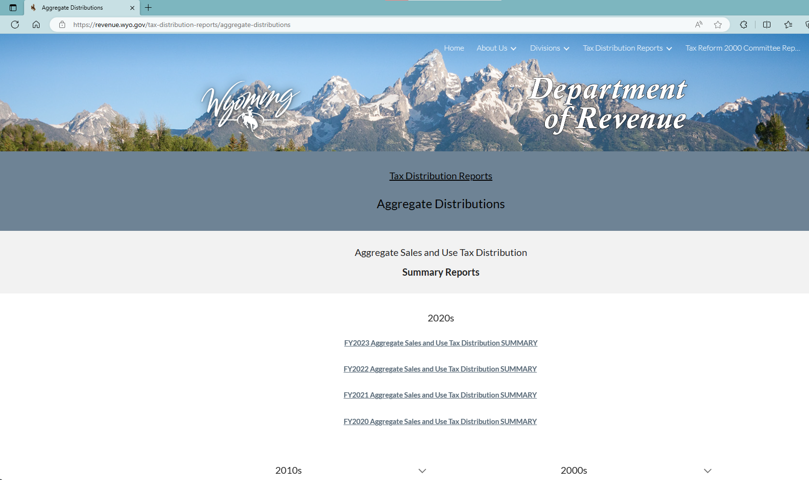

# README

1. Data source: [Aggregate Distributions (wyo.gov)](https://revenue.wyo.gov/tax-distribution-reports/aggregate-distributions), “Aggregate Sales and Use Tax Distribution Summary Reports”
    1. Manually copying numbers from PDF summary reports
    2. Use column “State Share Sales Tax (Gen Fund)” where a 4% rate applies to all counties. We ignore use tax in this state
    3. Each county takes a section, we use the total row of each section, e.g., 35080950 for 2001 file Natrona county (you may quickly locate this number in the pdf)

