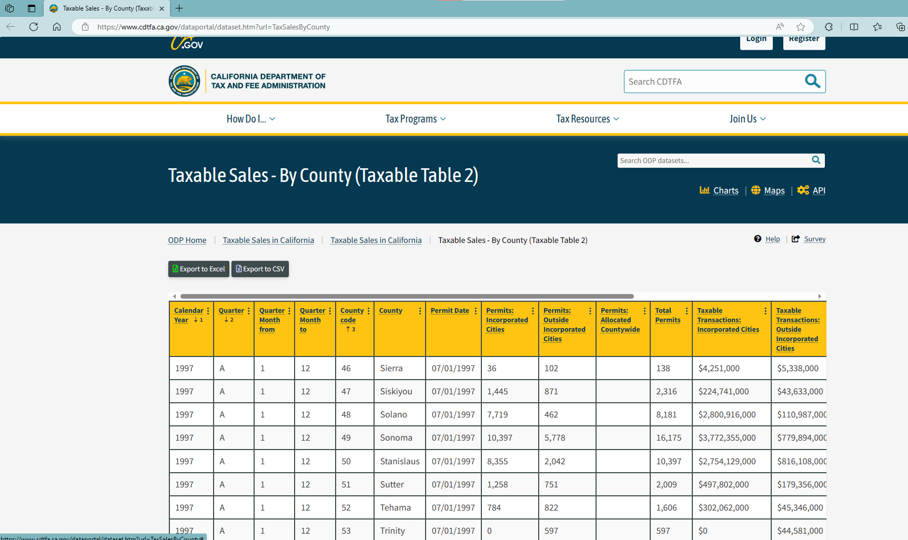

# README

1. Data source: [Taxable Sales - By County (Taxable Table 2), Grid View (ca.gov)](https://www.cdtfa.ca.gov/dataportal/dataset.htm?url=TaxSalesByCounty)
    1. Use the open data tools, export the records to an excel or csv
    2. Quarterly data since 1997. Column “quarter” equals “a” means annual aggregation
    3. Use column “Total Taxable Transactions”

