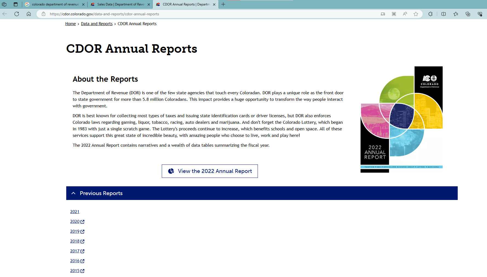
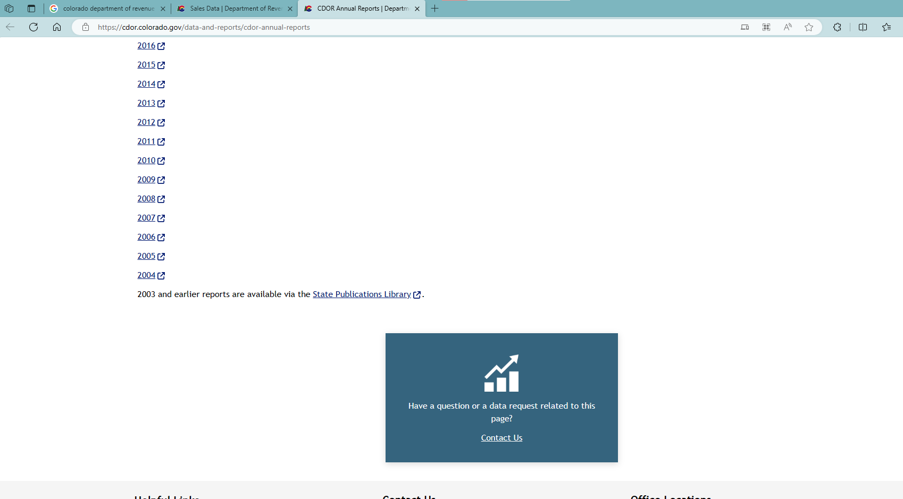
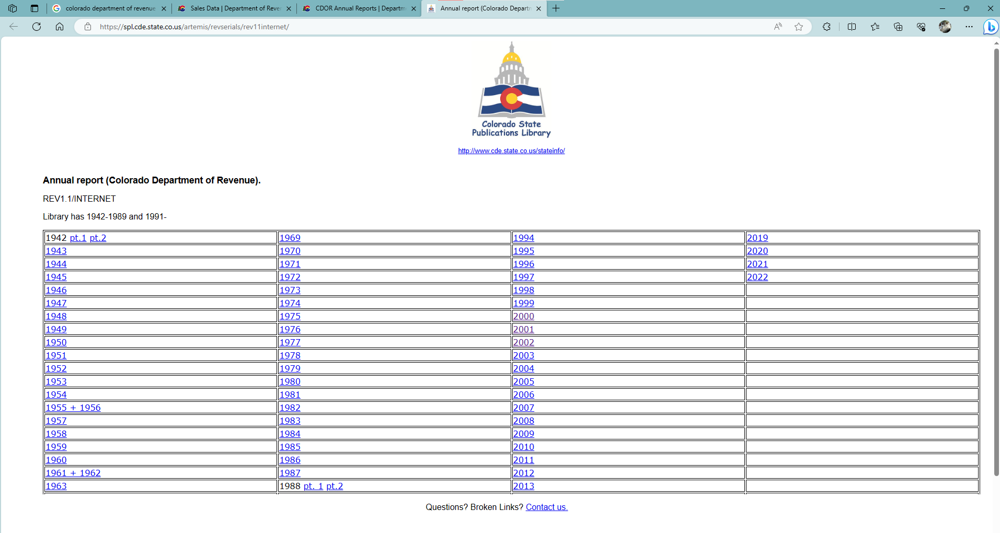
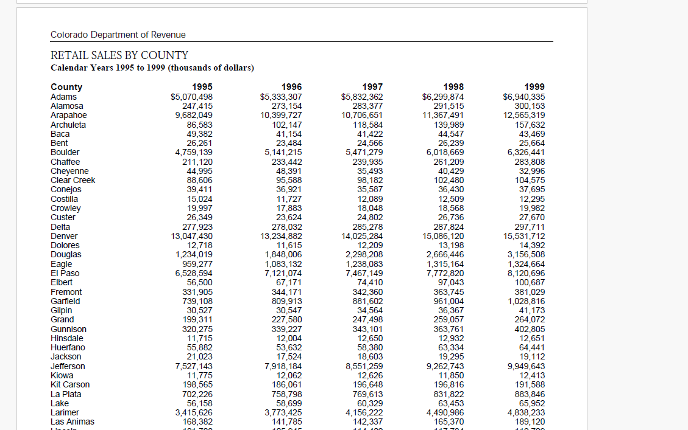
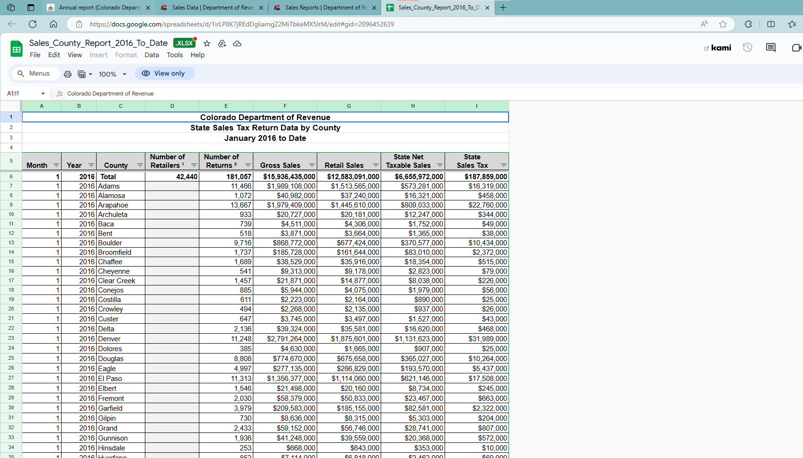
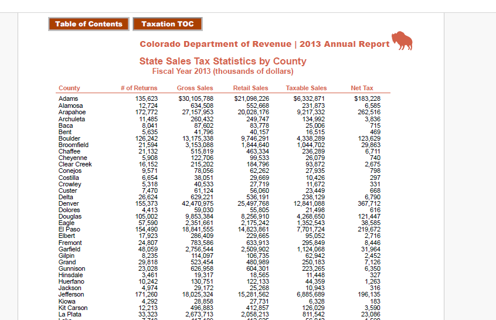

# README

1. Data source: [CDOR Annual Reports | Department of Revenue (colorado.gov)](https://cdor.colorado.gov/data-and-reports/cdor-annual-reports)
    1. For reports before 2004: [Annual report (Colorado Department of Revenue). (state.co.us)](https://spl.cde.state.co.us/artemis/revserials/rev11internet/)
    2. Colorado reports retail sales in annual reports until 2013. Starting from 2016, the data are provided in an excel file. We keep using “Retail Sales” even though “Gross Sales” are available.
    3. We do not adjust by local rates because the variation in local rates is small
    4. Notice: before 2016, sales are reported in thousands of dollars; since 2016, they are reported in dollars. We do conversion to thousands of dollars
2. Process by year:
    1. Until 2013: use retail sales from annual reports
    2. 2014 & 2015: first, linearly interpolate the total retail sales in the two years. Then, distribute the total retail sales according to the distribution determined by the closest year (i.e., using the distribution of retail sales in year 2013 to distribute the total retail sales in 2014)
    3. since 2016: use retail sales from digital records

